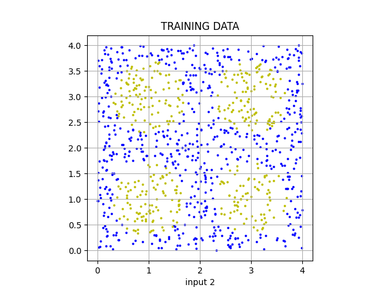
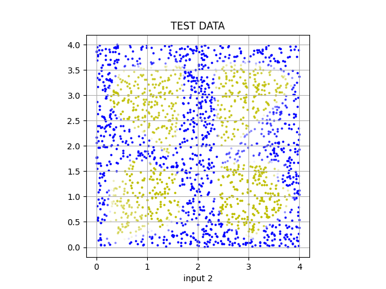
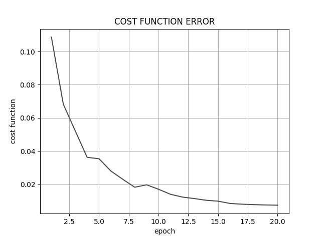

<h1 align="center">
FEEDFORWARD NEURAL NETWORK
</h1>

## Hello!
In the files above you'll find the most basic feedforward neural network. It has been created without usage of external libraries, like tensorflow, so that you could delve into how I managed to understand concept of this fascinating tool's principle of operation.

## Background
The neural network learns by a backpropagation algorithm. Its purpose is to determine the cost function gradient with respect to the network's both weights and biases (separately). Equations breathing life into plain neural network architecture have been listed below:
```math
\delta^{L} = \nabla_{a}C \odot \sigma ' (z^{L})
```
```math
\delta^{l} = ((w^{l+1})^{T}\delta^{l+1}) \odot \sigma ' (z^{l})
```
```math
\frac{\partial C}{\partial b_{j}^{l}} = \delta_{j}^{l} 
```
```math
\frac{\partial C}{\partial w_{jk}^{l}} = w_{k}^{l-1} \delta_{j}^{l}
```

These nicely formed equations appears in the code in a following form:
```math
\delta^{L} = (a^{L} - y) \odot \phi ' (z^{L})
```
```math
\delta^{l} = ((w^{l+1})^{T}\delta^{l+1}) \odot \phi ' (z^{l})
```
```math
\frac{\partial C}{\partial b^{l}} = \delta^{l} 
```
```math
\frac{\partial C}{\partial w^{l}} = a^{l-1} \otimes (\delta^{l} \phi ' (z^{l}))
```

where:
- $\delta^{L}$: error in the output layer,
- $\delta^{l}$: error in the l-th layer,
- $z^{L}$: input values of the output layer,
- $z^{l}$: input values of the l-th layer,
- $a^{L}$: output vector of output layer,
- $a^{l}$: output vector of l-th layer,
- $y$: expected output,
- $\phi()$: activation function
- $\frac{\partial C}{\partial b^{l}}$: cost function gradient with respect to the netowork's biases
- $\frac{\partial C}{\partial w^{l}}$: cost function gradient with respect to the netowork's weights

Above equations are used in the Stochastic Gradient Descent, where weights and biases are updated.
But before we'll go too deep, let's check out how does this neural network deal with different problems.

## Testing
### Logic test

Let's verify if our neural network works in a simple scenario. Suppose we have an array of 3 binary values. We put it into a magic box, close it, some magic happens, and we see that we've received an array of size 2 consisting of binary values as well. We do it for couple of different input arrays and we note what array we receive as an output:

| Input array  | Output array |
| ------------ | ------------ |
| [1, 1, 0]  | [0, 0]  |
| [1, 0, 1]  | [0, 1]  |
| [1, 1, 1]  | [0, 0]  |
| [0, 0, 0]  | [1, 1]  |
| [0, 0, 1]  | [1, 1]  |
| [0, 1, 0]  | [1, 0]  |

We could see, that the way the magic box works is that it just flips the first and second bit and rejects the third column.
The neural network, which stands for our brain, tells us that if we put, for example, [1, 0, 0] into our box, we could expect the outcome to be [0, 1].

In order to solve this task, the network's architecture has been defined as below:
| Layer  | Neurons |
| ------ | ------- |
| Input  | 3  |
| Output | 2  |

And the outcome:
| Input array  | Output array |
| ------------ | ------------ |
| [1, 0, 0]  | [0.05 0.89]  |

Seems like really simple architecture is enough for solving this task.
Let's try something more challenging then.

### Sum test
Let's perform a task similar to the previous one, but with larger number of both input and outputs. The array analogical to the previous one, standing for a training data, has been defined as follows:
| Input array  | Output array |
| ------------ | ------------ |
| [1, 1, 0, 0, 1, 0, 0, 1, 0]  | [0, 0, 0, 0, 1, 0, 0, 0, 0, 0]  |
| [0, 1, 0, 0, 0, 1, 0, 0, 0]  | [0, 0, 1, 0, 0, 0, 0, 0, 0, 0]  |
| [0, 1, 0, 1, 1, 0, 1, 1, 0]  | [0, 0, 0, 0, 0, 1, 0, 0, 0, 0]  |
| [0, 1, 0, 0, 1, 0, 0, 1, 0]  | [0, 0, 0, 1, 0, 0, 0, 0, 0, 0]  |
| [1, 1, 0, 1, 1, 1, 0, 1, 1]  | [0, 0, 0, 0, 0, 0, 0, 1, 0, 0]  |
| [0, 1, 0, 0, 1, 0, 0, 1, 0]  | [0, 0, 0, 1, 0, 0, 0, 0, 0, 0]  |
| ...  | ...  |

Can you see the pattern? Looks like the output array's index corresponding to the value of 1 tells us how many ones there are in the input array. For example - in the first row of the training data the number of ones in the input array's equal to 4. That's why one appears in the output array at index of 4.

Taking into account increased complexity of this task, the network's structure has been defined as below:
|   Layer  |  Neurons |
| -------- | -------- |
|   Input  | 9   |
|  Hidden  | 50  |
|  Output  | 10  |

The outcome for sample test data:
| Input array  | Output array |
| ------------ | ------------ |
| [0, 0, 1, 0, 0, 1, 0, 0, 0]  | [0.   0.04 0.99 0.01 0.   0.   0.   0.   0.   0.  ]  |

A value of 0.99 appears at the 2nd index of the output arrays which means that the sum of ones in the input array's equal to 2.

### Cartesian plane test
Let's create scenario which can be visualized nicer than using tables. For this purpose, let's take into account an input array consisting of 2 values in range between 0 and 4 each. The output is a single value - either 0 or 1. The graph below visualizes training data with 1000 randomly generated points and their classification which could be defined as - does the point belong to the one of the four circles?
<p align="center"></p>

The neural network structure has been defined as follows:
|   Layer  |  Neurons |
| -------- | -------- |
|   Input  | 2   |
|  Hidden  | 20  |
|  Hidden  | 20  |
|  Output  | 1  |

And output for 2000 randomly generated test data:
<p align="center"></p>

### MNIST
Let's try something a little bit more challenging and perform well known training on MNIST database of handwritten digits. The network's structure applied for this task:
|   Layer  |  Neurons |
| -------- | -------- |
|   Input  | 748   |
|  Hidden  | 128  |
|  Output  | 10  |

The graphs below illustrate the cost function and the accuracy change over epochs, i. e., number of times the neural network came through the whole training dataset:
<p align="center"></p>
<p align="center"></p>

The results for a data prepared for the testing purpose:
|   Input  |  Output | Input | Output
| -------- | -------- | -------- | -------- |
|  <p align="center"></p>  | 0 | <p align="center"></p>  | 5 | 
|  <p align="center"></p>  | 1 | <p align="center"></p>  | 6 |
|  <p align="center"></p>  | 2 |  <p align="center"></p>  | 7 |
|  <p align="center"></p>  | 3 |  <p align="center"></p>  | 8 |
|  <p align="center"></p>  | 4 |  <p align="center"></p>  | 3 |


90% accuracy for a simple dataset which hasn't been seen by this network before sounds really nice, especially taking into account the basic structure!

### Conclusions
The solution of above problems proves that the simplest neural network's form can already bring satisfyng outcomes.


## References
[1] http://neuralnetworksanddeeplearning.com/

[2] https://mattmazur.com/2015/03/17/a-step-by-step-backpropagation-example/

[3] https://playground.tensorflow.org

