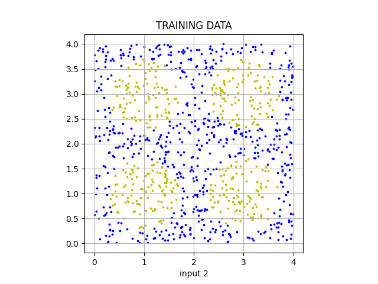
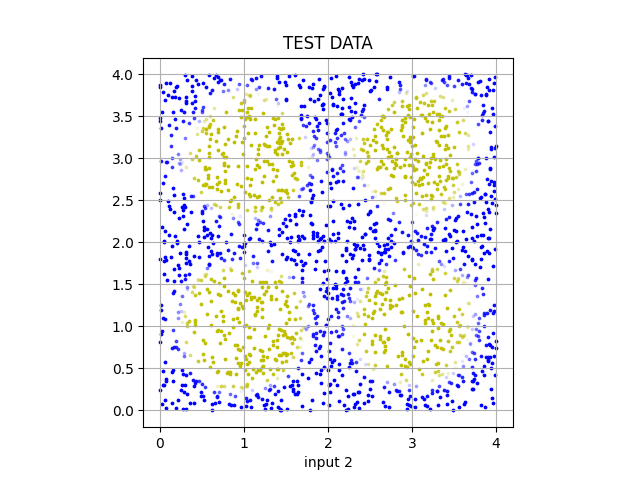

# Neural Network
The project contains neural network API allowing to build custom architecture deep learning models. The source code is written from scratch using _numpy_ which allows to investigate the model thoroughly during the learning process.

Neural network learns by a backpropagation algorithm - it is used to determine the cost function gradient with respect to the network's both weights and biases. The gradient is then utilized by the _Stochastic Gradient Descnet_ algorithm, which updates network parameters with new values. The program leverages the below equations __[1]__:
```math
\delta^{L} = \nabla_{a}C \odot \sigma ' (z^{L})
```
```math
\delta^{l} = ((w^{l+1})^{T}\delta^{l+1}) \odot \sigma ' (z^{l})
```
```math
\frac{\partial C}{\partial b_{j}^{l}} = \delta_{j}^{l} 
```
```math
\frac{\partial C}{\partial w_{jk}^{l}} = a_{k}^{l-1} \delta_{j}^{l}
```

where:
- $\nabla_{a}C$: cost function gradient with respect to output layer activations,
- $\delta^{L}$: error in the output layer,
- $\delta^{l}$: error in the l-th layer,
- $z^{L}$: input values of the output layer,
- $z^{l}$: input values of the l-th layer,
- $a^{L}$: output vector of output layer,
- $a^{l}$: output vector of l-th layer,
- $\frac{\partial C}{\partial b^{l}}$: cost function gradient with respect to the netowork's biases,
- $\frac{\partial C}{\partial w^{l}}$: cost function gradient with respect to the netowork's weights.

## Demo
Let's take into consideration a Cartesian plane, where the coordinates are from a $\langle 0; 4 \rangle$ range. The points in this coordinate system can be classified on two groups - either yellow, or blue. Their color depends on the values of their coordinates - if they place the point inside one of the 4 circles, their colour is yellow and blue otherwise. The graph below visualizes training data with 1000 randomly generated points and their classification:
<p align="center"></p>

The problem has been introduced to the network of the below architecure:
|   Layer  |  Neurons | Activation |
| -------- | -------- | ---------- |
|   Input  | 2   | None |
|  Dense  | 100  | Sigmoid |
|  Dense  | 100  | Sigmoid |
|  Dense  | 100  | Sigmoid |
|  Dense  | 1  | Sigmoid |

Training parameters:
- epochs: 200,
- learning rate: 0.03,
- optimizer: SGD,
- loss function: MSE.

Training data: 1000 random samples of (2, 1) shape.
Test data: 2000 random samples of (2, 1) shape.

The result of classification for 2000 randomly generated test data:
<p align="center"></p>

Learning process on the training data:
<p align="center"></p>


## References
__[1]__ http://neuralnetworksanddeeplearning.com/

__[2]__ https://mattmazur.com/2015/03/17/a-step-by-step-backpropagation-example/

__[3]__ https://playground.tensorflow.org

